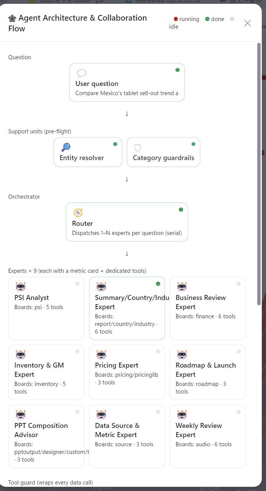
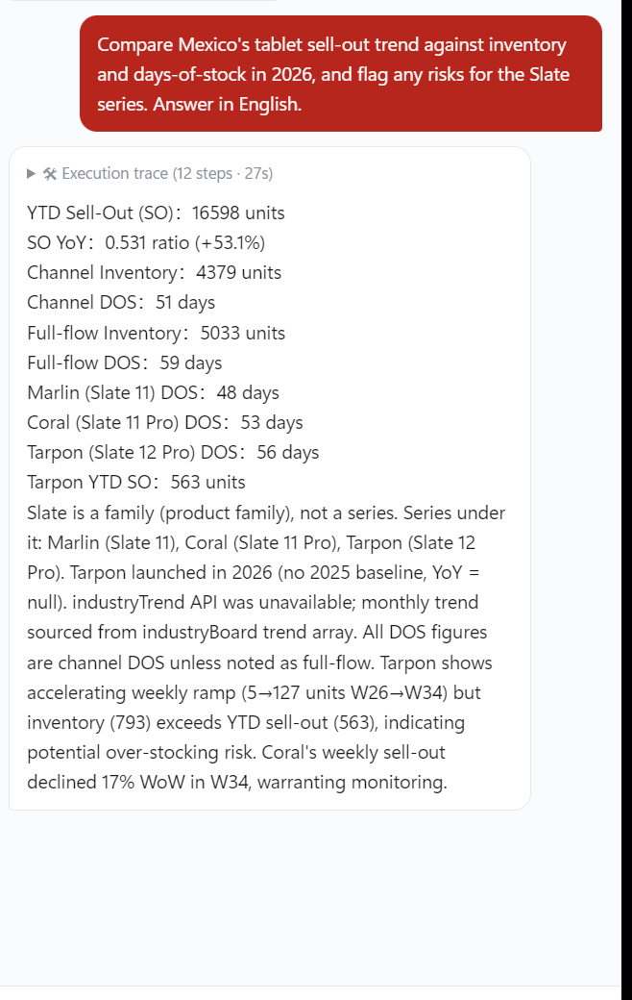
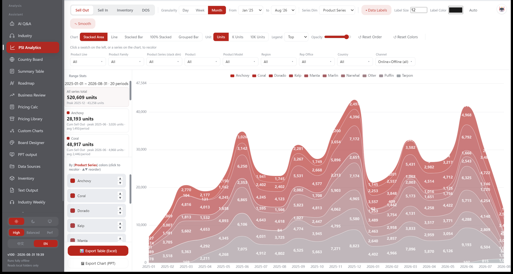
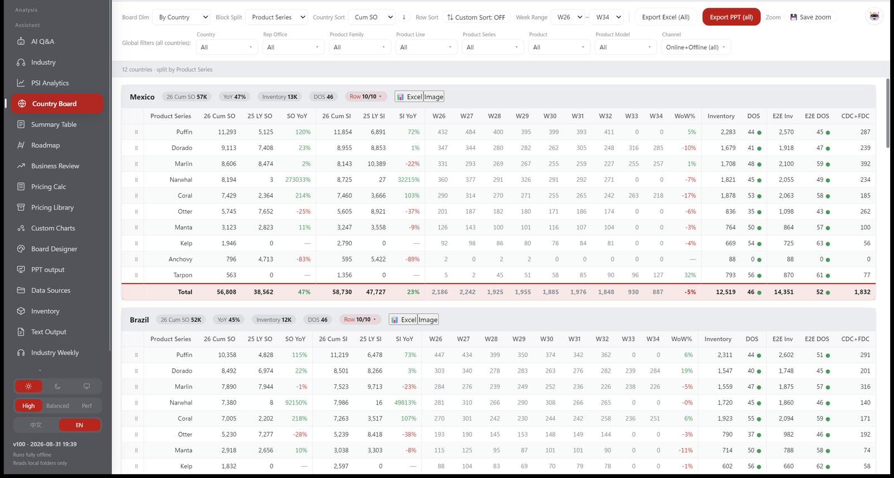
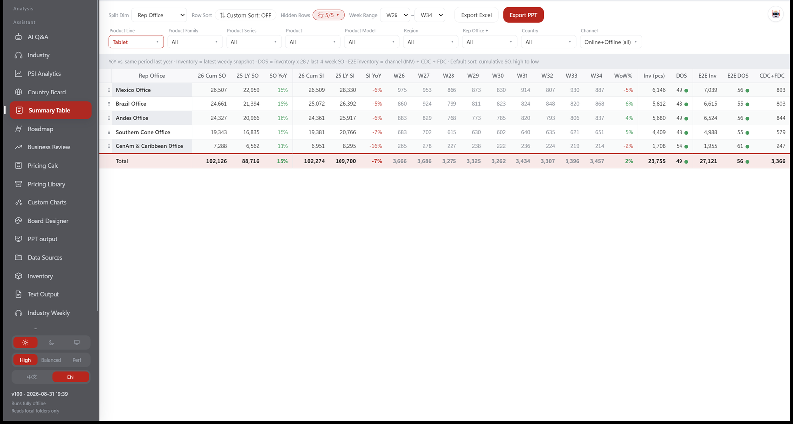
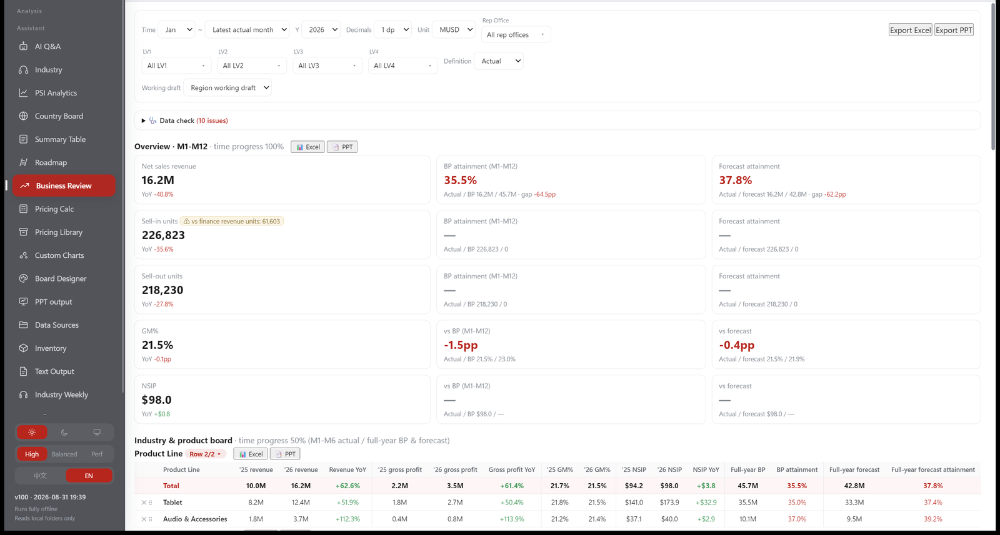
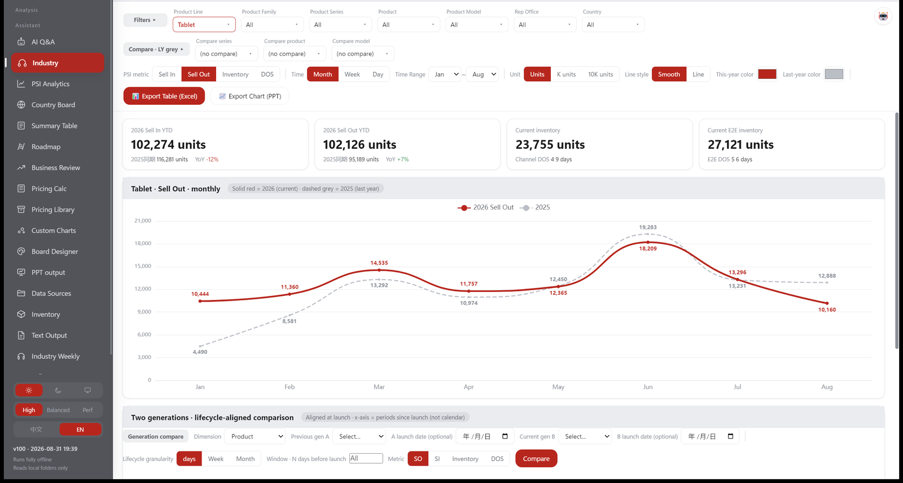
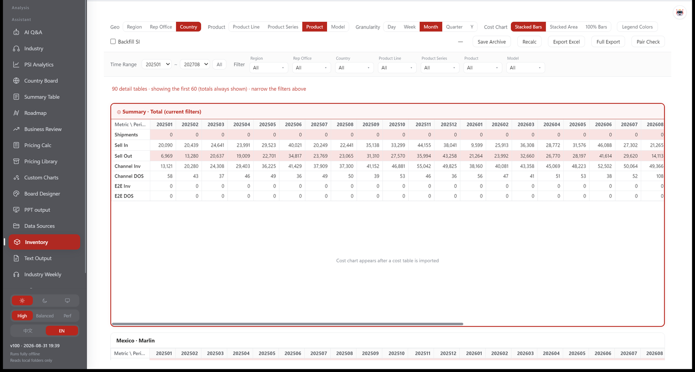

# Salesboard

> **Educational use only.** This project is published for learning and demonstration.
> Commercial use is not permitted; anyone considering commercial use is solely
> responsible for legal and regulatory compliance in every applicable jurisdiction.
> See [LICENSE](LICENSE).

**An AI-powered analytics product for channel-sales teams — built by the person who ran the channel.**

Import raw operating spreadsheets → 15 interactive boards (PSI, inventory, finance vs. budget, pricing, roadmap & launch) → a built-in AI analyst that answers business questions against live data, with every number traceable to a real query.

> 120+ shipped releases and counting. Built entirely on personal time and equipment; contains no employer code or data. All demo data is synthetically generated with a fixed seed (fully reproducible).

## The pain it solves

Every Monday, channel-sales analysts across a dozen countries rebuild the same reviews by hand: pull sell-in/sell-out/inventory extracts, recompute days-of-stock, reconcile finance vs. PSI, paste it all into a deck. The rules are tribal (three different DOS definitions, rates that must never be arithmetically averaged, late-reporting channels where a missing week means *not reported*, not zero) — so generic BI tools produce confidently wrong numbers.

I ran this workflow for years as a channel-sales category lead across Latin America. This product is how I automated myself.

## What it is

- **15 boards** over one analytics engine: PSI time series, inventory & days-of-stock, finance vs. budget (BP version compare, achievement, NSIP), per-country pricing, product roadmap & launch management, sell-out simulation, industry views, one-click weekly-review PPT generation (template designer with data binding).
- **Built-in AI analyst**: a router decomposes a business question and dispatches **9 domain-expert agents** (PSI, finance, inventory, pricing, roadmap…), each carrying locked metric definitions and a whitelist of **read-only data tools**; a synthesizer merges structured claims into one answer.
- **Dual runtime, privacy first**: cloud LLM API (OpenAI-compatible) or **fully on-device open-source models** — sensitive sales data never has to leave the laptop. Q&A content is deliberately never written to disk.

## What it looks like

*Running on the synthetic dataset — fictional products ("Slate" tablets, "SonicBuds" audio), fixed seed, fully reproducible.*

**The multi-agent analyst at work** — the built-in 🕸 board renders the real architecture with live status while a question runs: entity resolver and category guardrails pre-flight the question, a router dispatches 1–N of the nine domain experts (each with a locked metric card and read-only tools), a tool guard wraps every data call, and a provenance gate checks every number on the way out. On the right: a real cross-board answer — English question in, traced numbers out, with the 12-step execution trace one click away.

| Agent architecture & live flow | A real answer, fully traced |
|:---:|:---:|
|  |  |

**PSI analytics** — sell-in / sell-out / inventory / days-of-stock as a time series, stacked by any dimension, with range statistics on the left.



**Country board** — one performance grid per country: cumulative sell-out and sell-in, YoY, the last nine weeks, inventory, channel DOS and end-to-end DOS.



**Summary table** — the same metrics rolled up by any dimension, with the metric definitions stated in the caption line rather than buried in a wiki.



**Business review** — actuals against budget and forecast: attainment, progress gap, GM% and NSIP, plus a data-quality check that counts anomalies before anyone quotes a number.



**Industry view** — category KPIs with year-on-year comparison, and a lifecycle-aligned comparison that lines two product generations up at their launch dates instead of on the calendar.



**Inventory** — full-chain stock and days-of-stock by period, per country and model, with archive and pair-check tooling.



## The trust architecture (the interesting part)

Numbers in a sales org trigger purchase orders and price moves — a fabricated number is worse than no answer. So correctness is enforced in code, not requested in prompts:

1. **Metric governance**: DOS/NSIP formulas, aggregation red-lines ("inventory snapshots must never be summed across periods", "rates re-aggregate from numerators and denominators") are locked into every agent's instruction card.
2. **Tools do the math**: period sums, shares and totals are computed by the data tools, never by the model (LLMs add 5,645 as 5,944 more often than you'd hope).
3. **Guarded inputs**: filter values are validated against the live dimension dictionary — put a product name in the wrong dimension and the tool names the mistake instead of silently returning empty; invalid years/params come back as readable errors the model can self-correct from.
4. **Provenance gate**: every number in the final answer is traced back to this session's actual tool returns (transform-aware: ×100, rounding, differences of backed pairs). Anything untraceable is **replaced with "?" and flagged** — fabrication is blocked at the door, not warned about.

## Measured, not vibed

The repo ships a 30-question evaluation harness (`eval/`) with severity grading — *wrong-and-harmful* (a fabricated number) is a red line separate from *wrong-but-harmless* (an honest "not in the data"). Ground truth is computed by the analytics engine itself over the synthetic dataset, so the benchmark is fully reproducible; a parametric mode recomputes truths at runtime against any mounted dataset.

Eval-driven iteration, same 30 questions, human-reviewed grading on every run:

| Run | Setup | Accuracy | Red-line (harmful) errors |
|---|---|---|---|
| Baseline | local 30B (CPU) | 15.0% | 11 |
| A | cloud model, same program | 33.3% | 6 |
| B | + period/parameter discipline | 33.3% | 8 |
| C | + dimension validation | 36.7% | 8 |
| D | + provenance gate | 41.7% | 6 — invented-number class eliminated by the gate |
| E | release-86 orchestration refinements + provider model refresh | 80.0% | 0 — first pass over the bar (≥80%, zero red lines) |
| F | cross-vendor model switch, same harness | 88.3% | 0 — guardrails hold across vendors |
| **G** | **+ finance-agent caliber fixes (release 102)** | **95.0%** | **0 — best fully human-reviewed run** |

Findings that shaped the design: guardrail behavior varies up to 40pp between identical runs (single-run evals can't certify safety); prompts plateau where determinism is required — the fixes that held were all mechanism-level (validation, tool-side math, the gate). **Full methodology, grading rubric and findings: [docs/EVALUATION.md](docs/EVALUATION.md)** · raw run records in `eval/runs/`.

## Engineering

Electron + a pure-function analytics core (**87 test files** in this repo's suite, all green — `npm test`), streaming responses, per-request token/latency budgets tuned for on-device inference, bilingual UI (中/EN runtime toggle). `node scripts/make-demo-data.js` regenerates the full synthetic world (43k rows, 12 countries, deliberately embedded edge cases: EOL tail inventory, pre-launch demo units, late-reporting channels, seasonality).

## Run it

```bash
npm install
node scripts/make-demo-data.js   # generate the synthetic dataset (fixed seed)
npm start
```

Prefer a packaged build? Grab the portable **Salesboard.exe** from [Releases](https://github.com/lucasopsioi/salesboard/releases/latest) — no install, no dependencies. It opens on a bundled synthetic dataset, so every board is populated from the first second; point it at your own exports later from the Data sources board.

Point the three data sources at `demo-data/psi`, `demo-data/finance`, `demo-data/flow` in the Sources board. To use the AI analyst, add an OpenAI-compatible API endpoint in ⚙ settings, or drop a GGUF model next to the app for fully-local inference.

---
*Personal project. No employer code or data. Demo data is fictional ("Slate" tablets, "SonicBuds" audio) and reproducible from a fixed seed.*

## Version history

Every shipped build is a tag on `main` (v55 onwards, original build dates preserved), and the portable exe on the Releases page is built from the newest one. [CHANGELOG.md](CHANGELOG.md) lists them with one line each.
